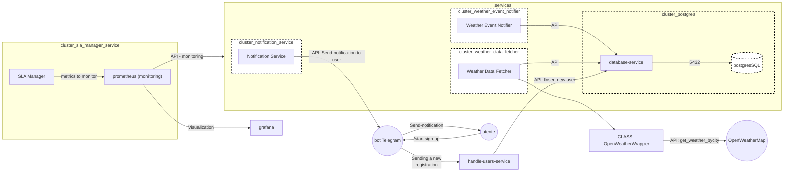

# ProgettoDSBD_2023-2024

```mermaid
 graph LR
    subgraph services
        subgraph cluster_postgres
        style cluster_postgres yellow fill:#fff,stroke:#000,stroke-width:2px,stroke-dasharray:5
        B[database-service] --> |5432| A[(postgresSQL)]
        end

        subgraph cluster_weather_event_notifier
            style cluster_weather_event_notifier fill:#fff,stroke:#000,stroke-width:2px,stroke-dasharray:5
            C["Weather Event Notifier"] -->|API| B[database-service]
        end

        subgraph cluster_weather_data_fetcher
            style cluster_weather_data_fetcher fill:#fff,stroke:#000,stroke-width:2px,stroke-dasharray:5
            E["Weather Data Fetcher"] -->|API| B[database-service] 
        end

        subgraph cluster_notification_service
            style cluster_notification_service fill:#fff,stroke:#000,stroke-width:2px,stroke-dasharray:5
            D["Notification Service"]
        end
    end

    subgraph cluster_sla_manager_service
        M[SLA Manager] -->|metrics to monitor| H
    end

    H["prometheus (monitoring)"] --> |API - monitoring| services
    H -->|Visualization| grafana
    D --> |API: Send-notification to user| I((bot Telegram)) 
    I --> |Sending a new\nregistration| L[handle-users-service]
    L --> |API: Insert new user| B
    E --> N[CLASS: OpenWeatherWrapper] -->|API: get_weather_bycity| O((OpenWeatherMap))


    style A fill:#fff,stroke:#000,stroke-width:2px,stroke-dasharray:5

    user1((utente)) -->|/start sign-up| I
    I --> |Send-notification| user1
```
