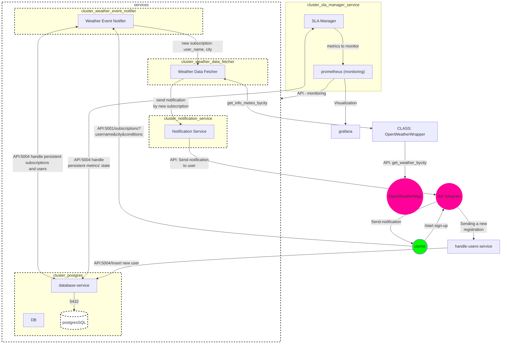

# ProgettoDSBD_2023-2024

Progetto Elaborato del corso di DISTRIBUTED SYSTEMS AND BIG DATA.

## Tabella dei Contenuti

- [Descrizione](#descrizione)
- [Installazione](#installazione)
- [Utilizzo](#utilizzo)
- [Autori](#autori)

## Descrizione

Il progetto è suddiviso in: prima-parte e seconda-parte.



## Installazione

Passaggi necessari per l'installazione e la configurazione del progetto.

```bash
# Esempio di comando di installazione
docker-compose up
```

## Utilizzo

...

## Autori

Giovanni Domenico Tassi, Oleksandr Merlino Lenko
