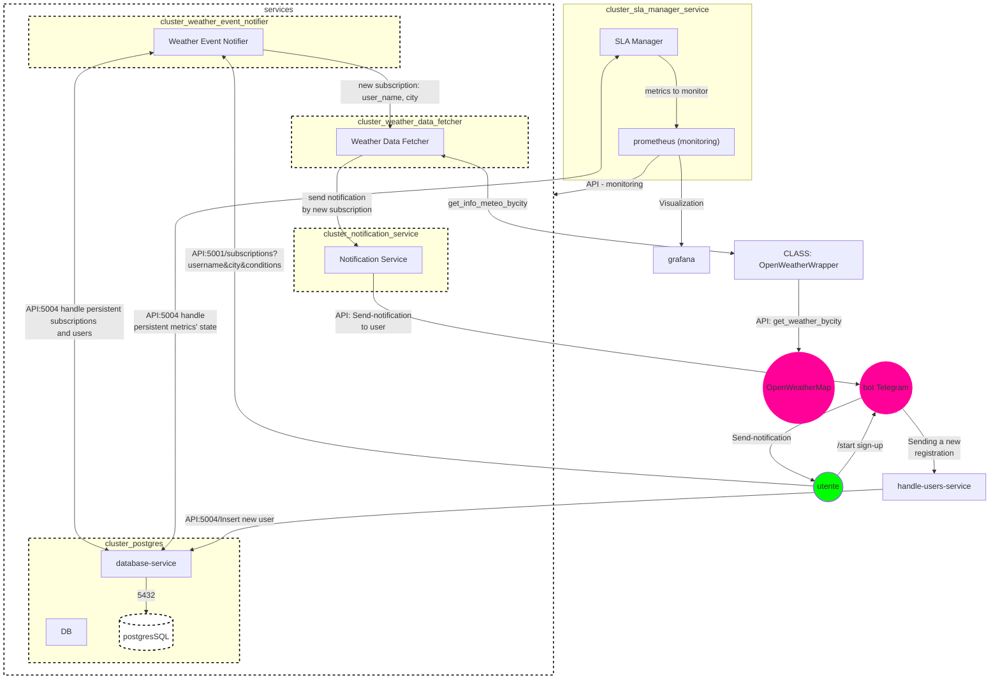
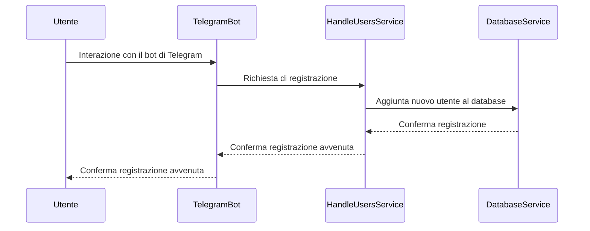
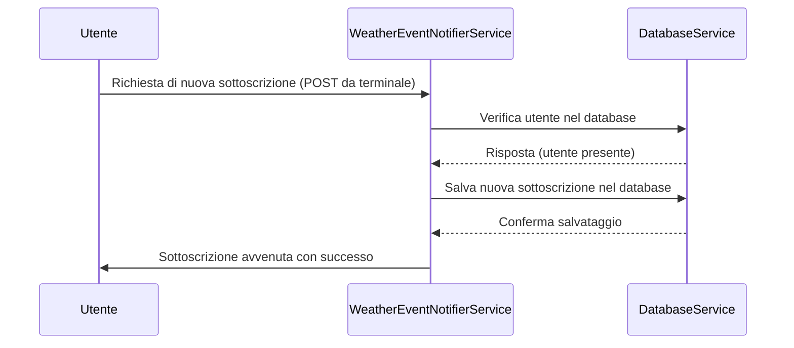
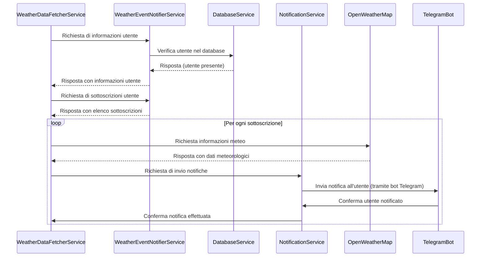
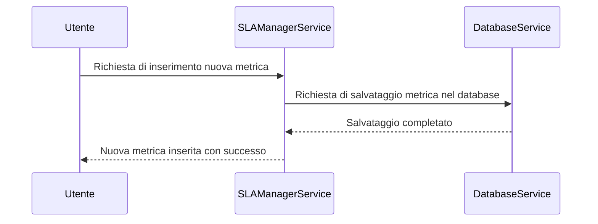

# ProgettoDSBD_2023-2024

Progetto Elaborato del corso di DISTRIBUTED SYSTEMS AND BIG DATA.

## Tabella dei Contenuti

- [Descrizione](#descrizione)
- [Architettura del Sistema](#architettura-del-sistema)
    - [Diagramma Architetturale](#diagramma-architetturale)
    - [Interazioni Sistema](#interazioni-sistema)
- [Installazione e Configurazione](#installazione-e-configurazione)
- [Utilizzo](#utilizzo)
- [Relazione Progetto](#relazione-progetto)
    - [Abstrat](#abstract)
    - [Scelte-Progettuali](#scelte-progettuali)
    - [API implementate](#api-implementate) 
- [Autori](#autori)


## Descrizione

Il progetto prevede l'implementazione di un'applicazione distribuita tramite Docker-Compose che consente agli utenti, una volta registrati tramite il bot di telegram "giosa-weather-alerts", di inserire delle sottoscrizioni per poter ricevere le notifiche sulle informazioni meteo delle città interessate e secondo le condizioni scelte. Abbiamo cercato quindi di seguire l'Applicazione1, descritta nei requisiti dell'elaborato, personalizzandola secondo ciò che abbiamo scelto di implementare.\n
Nella cartella Documentazione è presente un pdf con la spiegazione del progetto, dei servizi e dei concetti chiave impiegati, oltre ad esserci già in questo file Readmi una breve descrizione e tutte le informazioni richieste per la consegna dell'elaborato stesso, come l'abstract e le scelte progettuali. Inoltre, sempre nella cartella Documentazione, è presente un pdf "Test esecuzione sistema", in cui attraverso delle immagini si vede la prova della verifica delle funzionalità dell'applicazione.

## Architettura del Sistema
## Diagramma Architetturale

Nella figura sottostante viene mostrato il diagramma di flusso del sistema.


## Interazioni Sistema

### Diagramma 1: Registrazione Utente


### Diagramma 2: Nuova Sottoscrizione ad un Evento Meteo



### Diagramma 3: Aggiornamento Dati Meteorologici



### Diagramma 4: Aggiunta nuova metrica



## Installazione e Configurazione

Passaggi necessari per l'installazione e la configurazione del progetto.

### 1. Clonare il Repository:

```bash
git clone https://github.com/O46001509/ProgettoDSBD_2023-2024.git
cd ProgettoDSBD_2023-2024
```

### 2. Configurare le Variabili d'Ambiente:

Copia il file .env.example come .env, che contiene le variabili d'ambiente del DB, l'API KEY per le richieste a OpenWeatherMap e il TOKEN del bot Telegram, nel caso in cui non fosse presente il file .env dopo la clonazione.
```bash
cp .env.example .env
```
Se non presente il file .env o .env.example, quando si scarica il file zip da GitHub, creare il file .env nella directory principale, e inserire ciò che si vede nella sezione "Configurare le Variabili d'Ambiente" del pdf RelazioneProgetto".

### 3. Build dei Contenitori Docker:

```bash
docker-compose build
```

### 4. Avvio dei Contenitori Docker:

```bash
# Esecuzione microservizi
docker-compose up -d
```

### 5. Inizializzazione e risoluzione di eventuali interruzioni del Database:

Nel caso in cui non dovesse funzionare il servizio postgres o il database-service, entrare nella shell di postgres tramite il comando sottostante:
```bash
docker-compose exec -it postgres psql -U postgres
```

Una volta dentro, inserire il seguente comando per accedere al database:
```bash
\c weather_searches
```

Dopo di che, fare il drop delle tabelle presenti. Ex:
```bash
DROP TABLE sla_violations, sla_definitions, subscriptions, users;
```

Prima di fare il DROP delle tabelle è necessario stoppare, da un altro terminale, il container database-service che gestisce le interazioni col DB. Seguire la seguente:
```bash
# Recupero id del container database-service
docker container ls
```

```bash
# Stop database-service
docker stop id_container_database_service
```

Dopo aver droppato le tabelle è necessario interrompere l'esecuzione dei microservizi e riavviare.
```bash
docker-compose down
```

```bash
docker-compose up -d --build
```

Se si vuole, invece, solo visualizzare le tabelle è possibile farlo in qualsiasi momento l'app è in esecuzione. Ex:# Dopo l'accesso al database ```bash SELECT * FROM subscriptions; ```
Inoltre, se si scarica il zip da GitHub potrebbe esserci il seguente errore dopo la prima esecuzione del programma (a causa di push errate in GitHub che modificano o non inseriscono tutti i file presenti nella cartella locale postgres-data): 

Se presente, interrompere l’esecuzione dei servizi e svuotare la cartella postgres-data, che si trova all’interno della cartella progetto. Dopo aver cancellato tutti i file, riavviare il sistema ```bash docker-compose up -d --build``` ed entrare nel DB (come spiegato sopra). Se dopo l’inserimento del nome del DB col comando ```bash \c weather_searches``` appare questo errore: 

creare il db ```bash CREATE DATABASE weather_searches;```. Fatto questo, riavviare il sistema nuovamente e come si vede anche nel pdf TestEsecuzioneSistema, non ci sarà più l’errore e sarà presente il database. Inoltre, saranno presenti anche le tabelle, anche se vuote.

### 6. Verifica l'Applicazione:
L'applicazione sarà ora accessibile agli indirizzi specificati nelle configurazioni, dopo aver verificato che i microservizi siano attivi e funzionanti. Seguire a questo punto i passi della sezione Utilizzo.

### 7. Accesso a strumenti di monitoraggio
- Prometheus: http://localhost:9091
- Grafana: http://localhost:3001 (credenziali di default: admin/admin)
- cAdvisor: http://localhost:8081 

## Utilizzo

### 1. Avvio del Progetto:

Assicurati che Docker sia installato nel tuo sistema e di dover svolgere i controlli come indicati nella sezione precedente [Installazione e Configurazione](#installazione-e-configurazione).
Esegui il comando docker-compose up -d --build dalla directory principale del progetto per avviare l'applicazione e i relativi servizi in modalità detached.

### 2. Interazione con il Bot Telegram "giosa-weather-alerts":

Accedi al bot di Telegram "giosa-weather-alerts" e avvia il comando /start per iniziare la sottoscrizione alle notifiche meteorologiche.

### 3. Creazione di una Sottoscrizione:

Da un terminale, esegui il comando PowerShell per creare una sottoscrizione specificando i parametri desiderati come nome utente, città e condizioni meteorologiche.
```bash
$url = "http://localhost:5001/sottoscrizioni"
$headers = @{"Content-Type" = "application/json"}

$body = @{
    "user_name" = "Sasha"
    "citta" = "Barcellona"
    "condizioni" = @{
        "temperatura_massima" = 40
        "temperatura_minima" = -34
        "vento_max" = 99
        "umidita_max" = 99
    }
} | ConvertTo-Json

Invoke-WebRequest -Uri $url -Method Post -Headers $headers -Body $body
```

Verifica se ricevi le notifiche con le informazioni meteorologiche nella chat col bot quando le condizioni scelte sono soddisfatte.

### 4. Inserimento di una Metrica SLA:

Sempre da terminale, esegui il comando PowerShell per inserire una metrica SLA specificando il nome della metrica, la soglia e una breve descrizione.
```bash
$url = "http://localhost:5005/sla"
$headers = @{"Content-Type" = "application/json"}

$body = @{
    'metric_name' = 'active_subscriptions'
    'threshold' = 7
    'description' = 'Numero massimo di richieste di dati meteorologici ammesse per evitare il sovraccarico del servizio'
} | ConvertTo-Json

Invoke-WebRequest -Uri $url -Method Post -Headers $headers -Body $body
```

Verifica su Grafana o Prometheus se arrivano degli alert in caso di violazione della metrica SLAall'utente (azione descritta nel messaggio di Alert visibile sul bot).

### 5. Notifiche per Violazioni SLA:

Monitora la chat col bot per eventuali notifiche che indicano la violazione della metrica SLA e le azioni correttive che il sistema sta adottando o suggerisce all'utente.

## Relazione progetto

Di seguito, si hanno le parti della relazione del progetto; che sono incluse anche nel pdf presente all'interno della cartella Documentazione. Li abbiamo inserite anche qui per una visione istantanea ed efficace.

## Abstract

Il progetto ***ProgettoDSBD_2023-2024*** è stato sviluppato come parte del corso di "DISTRIBUTED SYSTEMS AND BIG DATA". L'obiettivo principale è la creazione di un sistema distribuito basato su un'architettura a microservizi, progettato per gestire alcune interazioni utente tramite un bot Telegram e fornire notifiche meteorologiche personalizzate, in funzione del fatto se si verificano le condizioni stabilite durante l'inserimento della sottoscrizione.
L'architettura modulare del sistema permette la scalabilità e la gestione efficace di funzionalità specifiche attraverso servizi dedicati, come il database-service per la memorizzazione dei dati degli utenti e le interazioni con PostgreSQL, il notification-service per l'invio di notifiche, l'handle-users-service per l'interazione con il bot Telegram, durante la fase di registrazione, il data-fetcher per la verifica delle condizioni delle sottoscrizioni e l'event-notifier per la gestione delle nuove sottoscrizioni. Quindi lo sla-manager, servizio essenziale per la verifica delle metriche inserite e l’aggiornamento delle violazioni.
Inoltre, il sistema implementa il monitoraggio attraverso Prometheus e Grafana, garantendo la visibilità delle metriche chiave del sistema. L'integrazione con OpenWeatherMap consente di fornire informazioni meteorologiche aggiornate.
Le scelte progettuali mirano a garantire una struttura robusta e flessibile, consentendo il facile adattamento del sistema a futuri sviluppi e requisiti.


## Scelte progettuali

Durante lo sviluppo del progetto, sono state prese diverse decisioni di progettazione per garantire un'architettura efficace e un funzionamento ottimale. Di seguito sono elencate alcune delle principali scelte progettuali:

### 1. Architettura a Microservizi: 
La decisione di adottare un'architettura a microservizi è stata motivata dalla necessità di separare le responsabilità e facilitare la scalabilità. Ogni microservizio è progettato per gestire specifiche funzionalità, consentendo una gestione modulare e indipendente.

### 2. Utilizzo di Docker: 
L'utilizzo di container Docker è stato scelto per garantire la portabilità dell'applicazione e semplificare il processo di distribuzione. Docker facilita la creazione, l'esecuzione e la distribuzione dei microservizi in ambienti diversi, garantendo coerenza e facilità di gestione.

### 3. Database-Service per PostgreSQL: 
La decisione di introdurre un "database-service" dedicato è stata presa per gestire le interazioni con PostgreSQL in modo centralizzato. Questo approccio semplifica la gestione del database, garantendo al contempo una maggiore coerenza nei dati e facilitando eventuali operazioni di scalabilità o migrazione del database.

### 4. Monitoraggio con Prometheus e Grafana: 
L'integrazione di Prometheus e Grafana è stata una scelta strategica per garantire il monitoraggio delle prestazioni e delle metriche chiave del sistema. Questi strumenti forniscono una visibilità approfondita sulle attività dei microservizi, facilitando la risoluzione dei problemi e l'ottimizzazione delle prestazioni. Nel nostro caso, usiamo Prometheus per monitorare i servizi che abbiamo e le metriche personalizzate inserite, potendo anche vedere tramite UI lo stato degli Alerts. Abbiamo provato Grafana per poter visualizzare meglio l’andamento di alcuni container, in termini di uso della memoria, di disco e della CPU, oltre a visualizzare anche la metrica personalizzata interval_seconds come varia nel tempo e in base al suo valore quando c’è una violazione oppure no.  

### 5. Comunicazione tramite API RESTful: 
Tutte le interazioni tra i microservizi sono gestite tramite API RESTful. Questa scelta favorisce la decentralizzazione e la comunicazione efficiente, consentendo una facile integrazione e scalabilità del sistema.

### 6. Strumenti di Notifica tramite Telegram: 
L'integrazione di un bot Telegram per le notifiche offre un canale di comunicazione efficace e immediato con gli utenti, migliorando l'esperienza complessiva dell'applicazione.

### 7. Gestione Asincrona con asyncio nel Notification Service: 
Tutte le interazioni tra i microservizi sono gestite tramite API RESTful. Questa scelta favorisce la decentralizzazione e la comunicazione efficiente, consentendo una facile integrazione e scalabilità del sistema. Non siamo arrivati ad implementare Kafka, al posto di asyncio o altro, ma molto probabilmente l’avremmo potuto sfruttare per gestire la grande quantità di notifiche inviate a telegram (quindi l’interazione tra il servizio notification-service e il bot telegram).

### 8. Utilizzo di APSScheduler nel SLA Manager: 
Per garantire la tempestiva esecuzione delle attività di gestione degli SLA, il servizio SLAManager fa uso del modulo APSScheduler. Questo scheduler offre un meccanismo efficiente per pianificare e eseguire operazioni periodiche, consentendo al servizio di monitorare e rispettare gli accordi di livello di servizio in modo accurato.

## API implementate

Il sistema ProgettoDSBD_2023-2024 implementa diverse API per gestire interazioni utente e servizi specifici. Di seguito sono elencate le principali API:

1. **Bot Telegram (/start):**
   - Descrizione: Inizializza la registrazione dell'utente attraverso il bot Telegram.
   - Metodo: Command (/start).
   - Endpoint: N/D.

2. **Weather-event-notifier (/subscriptions):**
   - Descrizione: Consente agli utenti di interagire con il sistema, principalmente attraverso il terminale, per gestire le sottoscrizioni relative agli eventi meteorologici.
   - Metodo: GET, POST, PUT, DELETE.
   - Endpoint: `/subscriptions`.
   - **Parametri Richiesti:** POST
       - `user_name` (string): L'user_name dell'utente.
       - `citta` (string): La città per cui ottenere le info-meteo.
       - `condizioni` (map): Sono le 4 condizioni che può scegliere l'utente e in base ad esse, se si verificano o meno, riceverà le notifiche o meno.

3. **Sla-Manager (/sla):**
   - Descrizione: Consente di interagire con il sistema, principalmente attraverso il terminale, per gestire le metriche da far rispettare.
   - Metodo: GET, POST, PUT, DELETE.
   - Endpoint: `/sla`.
   - **Parametri Richiesti:** POST
       - `metric_name` (string): Nome della metrica.
       - `threshold` (int): Il valore soglia che rappresenta il limite massimo accettabile per la metrica SLA.
       - `Description` (string): descrizione della metrica.

4.	Sla-Manager (/sla/status): 
	- Descrizione: Consente di visualizzare lo stato delle metriche.
	- Metodo: GET
	- Endpoint: `http//localhost:5005/sla`
	
5.	Sla-Manager (/sla/violations): 
	- Descrizione: Consente di visualizzare tutte le violazioni presenti.
	- Metodo: GET.
	- Endpoint: `http//localhost:5005/sla/violations`


## Autori

Giovanni Domenico Tassi, Oleksandr Merlino Lenko
