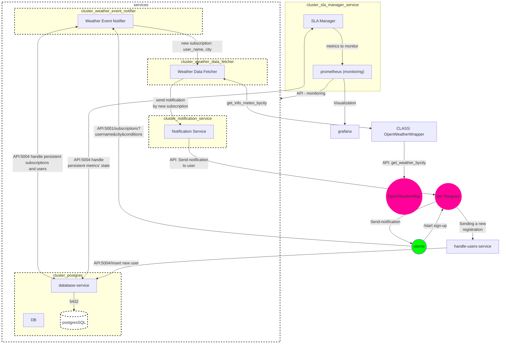
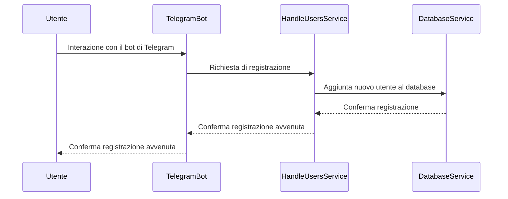
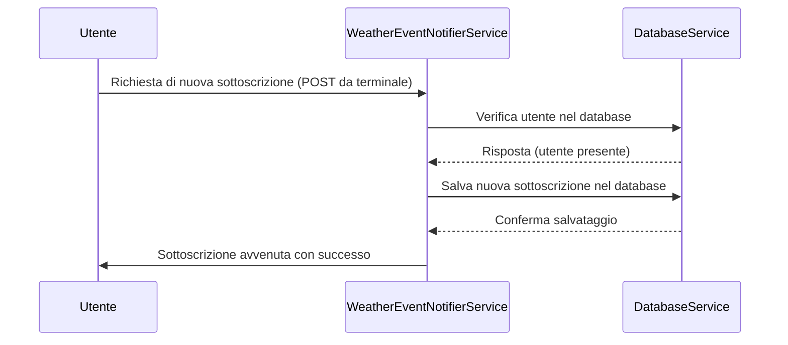
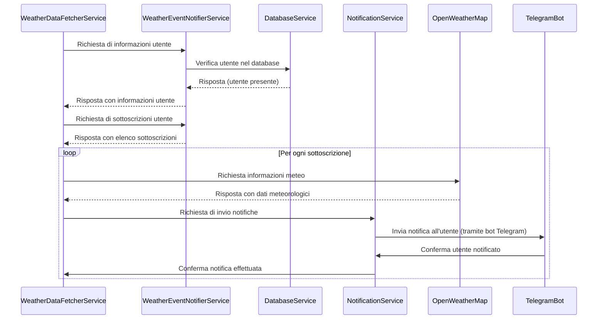
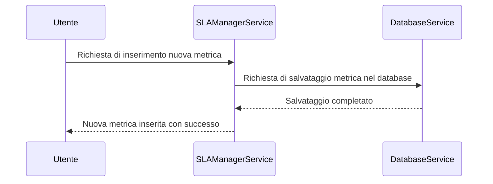

# ProgettoDSBD_2023-2024

Progetto Elaborato del corso di DISTRIBUTED SYSTEMS AND BIG DATA.

## Tabella dei Contenuti

- [Descrizione](#descrizione)
- [Architettura del Sistema](#ArchitetturaSistema)
    - [DiagrammaArchitetturale](#diagrammaarchitetturale)
    - [InterazioniSistema](#interazionisistema)
- [Installazione](#installazione)
- [Utilizzo](#utilizzo)
- [RelazioneProgetto](#relazioneprogetto)
    - [Abstrat](#abstract)
    - [ScelteProgettuali](scelteprogettuali)
    - [API_implementate](#API_implementate) 
- [Autori](#autori)

## Descrizione

Il progetto prevede l'implementazione di un'applicazione distribuita tramite Docker-Compose che consente agli utenti, una volta registrati tramite il bot di telegram "giosa-weather-alerts", di inserire delle sottoscrizioni per poter ricevere le notifiche sulle informazioni meteo delle città interessate e secondo le condizioni scelte. Abbiamo cercato quindi di seguire l'Applicazione1, descritta nei requisiti dell'elaborato, personalizzandola secondo ciò che abbiamo scelto di implementare.\n
Nella cartella Documentazione è presente un pdf con la spiegazione del progetto, dei servizi e dei concetti chiave impiegati, oltre ad esserci già in questo file Readmi una breve descrizione e tutte le informazioni richieste per la consegna dell'elaborato stesso, come l'abstract e le scelete progettuali.

## DiagrammaArchitetturale

Nella figura sottostante viene mostrato il diagramma di flusso del sistema.


## InterazioniSistema

### Diagramma 1: Registrazione Utente


### Diagramma 2: Nuova Sottoscrizione ad un Evento Meteo



### Diagramma 3: Aggiornamento Dati Meteorologici



### Diagramma 4: Aggiunta nuova metrica



## Installazione

Passaggi necessari per l'installazione e la configurazione del progetto.

### 1. Clonare il Repository:

```bash
git clone https://github.com/O46001509/ProgettoDSBD_2023-2024.git
cd ProgettoDSBD_2023-2024
```

### 2. Configurare le Variabili d'Ambiente:

Copia il file .env.example come .env, che contiene le variabili d'ambiente del DB, l'API KEY per le richieste a OpenWeatherMap e il TOKEN del bot Telegram, nel caso in cui non fosse presente il file .env dopo la clonazione.
```bash
cp .env.example .env
```

### 3. Build dei Contenitori Docker:

```bash
docker-compose build
```

### 4. Avvio dei Contenitori Docker:

```bash
# Esecuzione microservizi
docker-compose up -d
```

### 5. Inizializzazione e risoluzione di eventuali interruzioni del Database:
 Nel caso in cui non dovesse funzionare il servizio postgres o il database-service, entrare nella shell di postgres tramite il comando sottostante:
```bash
docker-compose exec -it postgres psql -U postgres
```

Una volta dentro, inserire il seguente comando per accedere al database:
```bash
\c weather_searches
```

Dopo di ché, fare il drop delle tabelle presenti. Ex:
```bash
DROP TABLE sla_violations, sla_definitions, subscriptions, users;
```

Prima di fare il DROP delle tabelle è necessario stoppare, da un altro terminale, il container database-service che gestisce le interazioni col DB. Seguire la seguente:
```bash
# Recupero id del container database-service
docker container ls

# Stop database-service
docker stop id_container_database_service
```

Dopo aver droppato le tabelle è necessario interrompere l'esecuzione dei microservizi e riavviare.
```bash
docker-compose down

docker-compose up -d --build
```

Se si vuole, invece, solo visualizzare le tabelle è possibile farlo in qualsiasi momento l'app è in esecuzione. Ex:
```bash
# Dopo l'accesso al database.
SELECT * FROM subscriptions;
```

### 6. Verifica l'Applicazione:
L'applicazione sarà ora accessibile agli indirizzi specificati nelle configurazioni, dopo aver verificato che i microservizi siano attivi e funzionanti.

### 7. Accesso a strumenti di monitoraggio
- Prometheus: http://localhost:9091
- Grafana: http://localhost:3001 (credenziali di default: admin/admin)

## Utilizzo

...

## Relazione progetto

Di seguito, si hanno le parti della relazione del progetto; che sono incluse anche nel pdf presente all'interno della cartella Documentazione. Li abbiamo inserite anche qui per una visione istantanea ed efficace.

## Abstract

...

## Scelte progettuali

...

## API implementate

...

## Autori

Giovanni Domenico Tassi, Oleksandr Merlino Lenko
